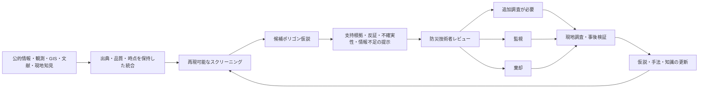

# DRR防災リスク知識基盤

## 概要

本プロジェクトは、既存の公的防災情報を置き換えることなく、
防災関連情報を出典・時点・品質・不確実性とともに関連付け、
追加確認が必要な災害発生スクリーニング仮説を防災技術者へ提示する
防災リスク知識基盤を構築する。

仮説は、確定した危険区域や災害発生予測ではない。
支持根拠だけでなく、反証、不確実性、missing information、
空間的位置、情報源及び生成手法を併せて提示し、技術者による
追加調査判断を支援する。

プロジェクトの正本となるGoal、原則、MVP範囲及び受入条件は
[SCOPE.md](SCOPE.md) に定める。

## Goal

- 公的防災情報、観測、地形・地質・GIS、文献及び現地知見を、
  相互運用可能な形で統合・参照できるようにする。
- 既存の指定・評価の外側又は十分に検討されていない区域を、
  再現可能なスクリーニング仮説として提示する。
- 仮説ごとに支持根拠、反証、不確実性、missing information、
  空間的位置、情報源、生成手法及び版を示す。
- 防災技術者及び関係機関が仮説をレビューし、判断理由を記録する。
- 現地調査及び事後検証の結果を、仮説と分析手法の改善へ還流する。

## システムの位置付け

本システムは、次を代替しない。

- 公式ハザード区域の指定
- 気象・災害警報
- 避難情報及び避難判断
- 行政機関又は防災技術者による意思決定
- 現地調査及び専門的な地質・工学評価

本システムが担うのは、既存情報の間にある検討上の空白を見つけ、
「どこを、なぜ、何が不足した状態で、追加確認すべきか」を
監査可能な仮説として整理することである。

## 最初のMVP

| 項目 | 内容 |
|---|---|
| 対象災害 | 土砂災害 |
| 対象地域 | 宮崎県延岡市及びその周辺 |
| 仮説単位 | 候補ポリゴン |
| 主な利用者 | 防災技術者及び関係機関 |
| 判断 | 追加調査が必要・監視・棄却 |

最初のMVPは、最終Goalを土砂災害だけに限定するものではない。
将来のマルチハザード及び複合・連鎖災害への拡張可能性を保持する。

## 想定ワークフロー

## 候補仮説

候補ポリゴンは `screening_candidate` として扱う。

候補には少なくとも次の情報を関連付ける。

- 安定した仮説ID
- 空間形状とCRS
- 災害種別
- 仮説の説明
- 生成手法、版及びパラメータ
- 支持根拠
- 反証
- 不確実性
- missing information
- 情報源と来歴
- 既存警戒区域及び既知災害との関係
- 再現性の状態
- レビュー結果と判断理由
- 現地調査又は事後検証結果

## 情報の扱い

### 支持根拠

仮説の妥当性を支持する観測、公式情報、解析結果、文献又は専門家知見。

### 反証

仮説の妥当性を弱める観測、解析結果、文献又は専門家知見。
反証が存在しても、自動的に仮説を棄却しない。

### 不確実性

測定誤差、モデル限界、空間・時間解像度、閾値依存性又は解釈の幅など、
存在する情報に含まれる不確かさ。

### Missing Information

未調査、未取得、アクセス不能、品質不明又は原処理不明など、
判断に必要だが存在を確認できない情報。

情報が存在しないことを、安全又は否定Evidenceとして扱わない。

## レビュー

防災技術者は、候補ごとに次のいずれかを記録する。

| 状態 | 意味 |
|---|---|
| `needs_additional_investigation` | 現地調査、追加データ又は詳細解析が必要 |
| `monitor` | 直ちに追加調査は行わないが、継続的に確認する |
| `dismissed` | 現時点の情報では追加調査を進めない |

レビューには判断理由、使用した情報、レビュアー及び日時を伴う。
`dismissed` は安全の保証又は災害可能性の不存在を意味しない。

## 設計方針

- Goal、利用者の判断フロー、データ契約及び受入条件から設計する。
- 特定の既存実装、クラウド、データベース、GIS製品又はAIへ依存しない。
- 最初のMVPの中核フローは、外部クラウドサービスなしでもローカルで実行・参照できるようにする。
- 外部の計算・保管サービスは、必要に応じて交換可能なアダプターとして利用する。
- 重要な入力、出力及び来歴は公開形式で保持し、外部サービスだけを正本としない。
- ドメインモデルと外部技術を分離する。
- 公式情報の原典と来歴を保持する。
- NoDataと情報不足を処理の最後まで区別する。
- 同一入力と同一手法から、同一の仮説を再現できるようにする。
- 分析、レビュー及び更新の履歴を監査可能にする。
- 既存構成より合理的であれば、スクラッチから設計・実装する。

開発時の詳細な作業原則は [AGENTS.md](AGENTS.md) に定める。

## MVP受入条件

最初のMVPは、少なくとも次を満たす必要がある。

- 候補ポリゴンを一意に識別し、地図上で確認できる。
- 候補ごとに支持根拠、反証、不確実性、missing information及び情報源を確認できる。
- 公式情報、観測、推定及びモデル出力を区別できる。
- 情報不足を安全又は否定Evidenceとして表示しない。
- 技術者が3種類のレビュー結果と判断理由を記録できる。
- 仮説生成及びレビュー判断の履歴を追跡できる。
- 現地調査又は事後検証の結果を追加できる。
- 代表的な候補を用いて、追加調査判断への有用性を評価できる。

候補数、モデル精度又は画面の完成だけでは、MVP達成とはみなさない。

## 将来の発展

最初のMVPで判断支援としての有用性を検証した後、次を検討する。

- 対象地域及び災害種別の拡張
- 複合・連鎖災害の仮説表現
- 動的観測及び公式警戒情報との連携
- 現地調査モバイルワークフロー
- 自治体・研究機関間の標準的なデータ連携
- 事後検証と分析手法評価
- 組織横断の知識共有と権限管理

## 注意事項

本システムの出力は、防災技術者による追加確認のためのスクリーニング情報である。
公式ハザードマップ、警報、避難情報、現地調査、地質評価、工学的評価又は
行政判断を代替しない。
